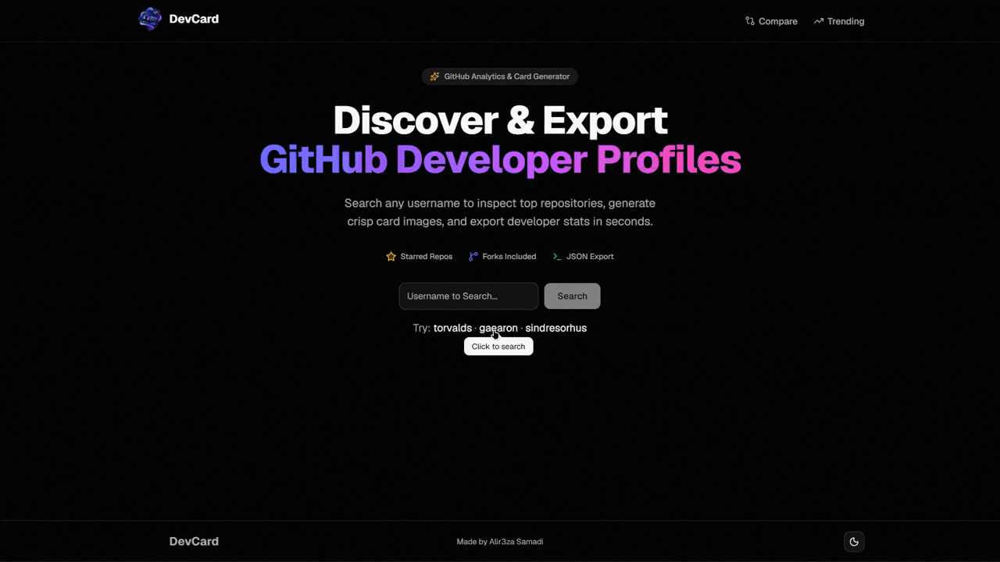
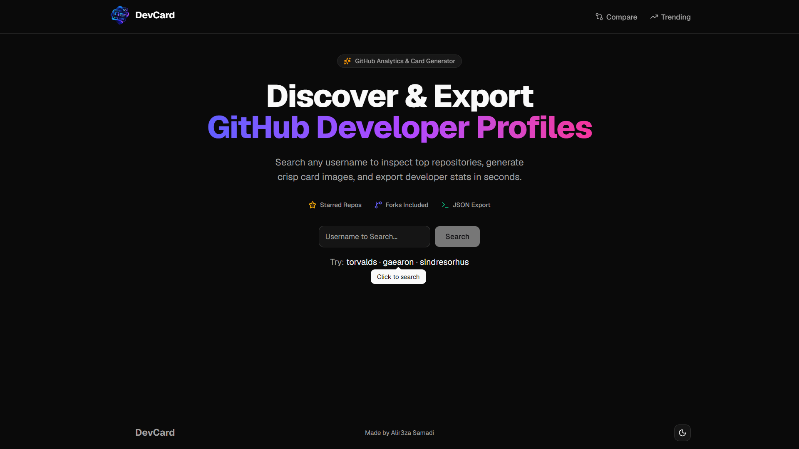
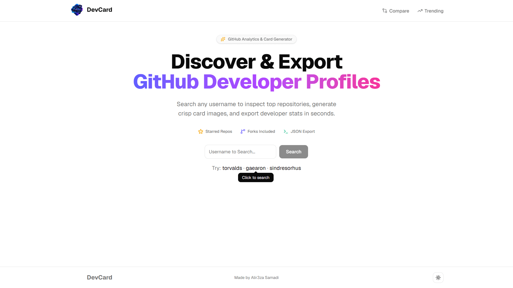
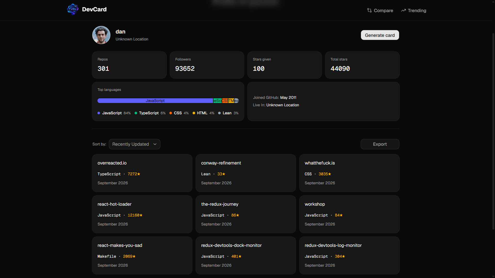
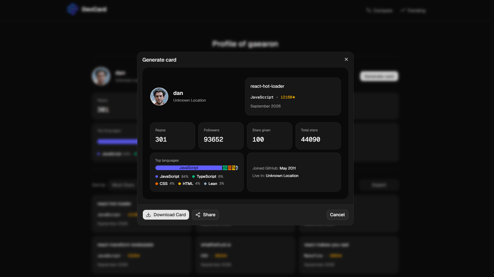
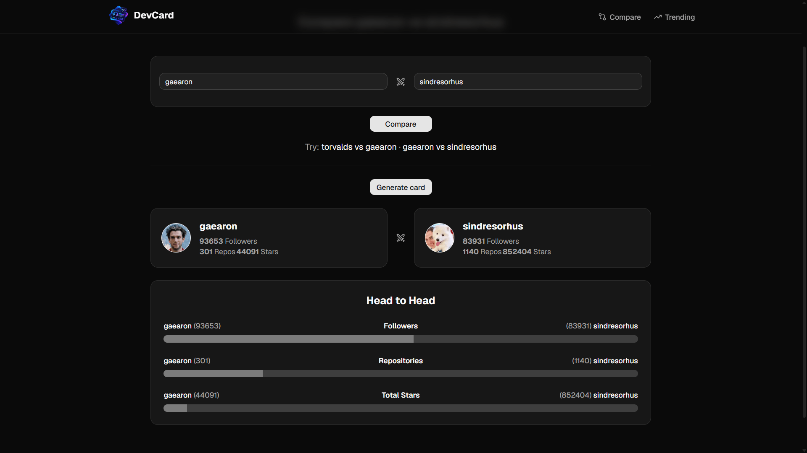
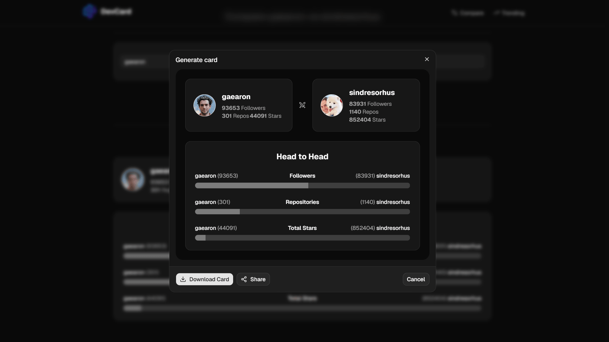
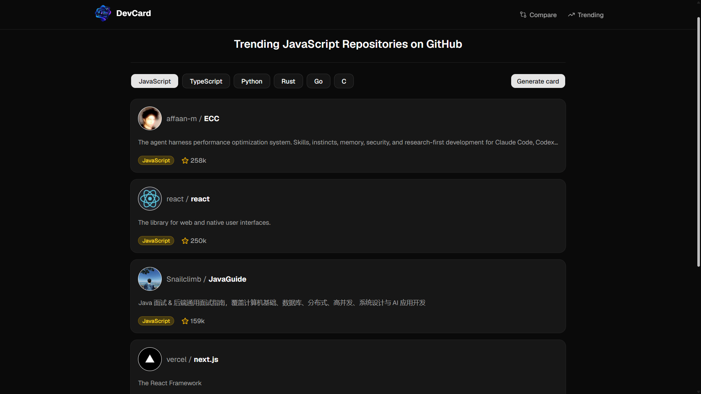

# GitHub DevCard

> Search any GitHub username, inspect their stats and top repos, and export a shareable "dev card" as a PNG.


**🔗 Live demo:** [github-dev-card-bypl.vercel.app](https://github-dev-card-bypl.vercel.app/)
> If the link doesn't load in your region, try opening it with a VPN enabled.

## Demo

<div align="center">
  
</div>

<br/>

### Home Page

<table>
<tr>
<td width="50%"><p align="center"><sub>Default theme</sub></p></td>
<td width="50%"><p align="center"><sub>Light theme</sub></p></td>
</tr>
</table>

### Profile Page

<table>
<tr>
<td width="50%"><p align="center"><sub>Profile view</sub></p></td>
<td width="50%"><p align="center"><sub>Generated card export</sub></p></td>
</tr>
</table>

### Compare Page

<table>
<tr>
<td width="50%"><p align="center"><sub>Head-to-head comparison</sub></p></td>
<td width="50%"><p align="center"><sub>Generated card export</sub></p></td>
</tr>
</table>

### Trending Page

<table>
<tr>
<td width="50%"><p align="center"><sub>Trending repositories</sub></p></td>
<td width="50%"><p align="center"><sub>Generated card export</sub></p></td>
</tr>
</table>

## Features

- 🔍 **Search any GitHub username** and jump straight to a full profile view
- 📊 **Profile stats** — followers, public repo count, total stars collected across all repos, top languages breakdown
- ⭐ **Highlighted repo** — automatically surfaces the user's most-starred (or most recently updated) repository
- 🖼️ **Exportable dev card** — renders the profile as a styled card and downloads it as a PNG, client-side, with no server round-trip
- ⚖️ **Compare mode** — put two GitHub users head-to-head
- 📈 **Trending repos** — browse trending repositories filtered by language and time window
- 🌓 **Light / Dark / System theme toggle** — persisted across visits, with no flash of the wrong theme on initial load
- 📱 **Responsive navbar** — dedicated mobile menu alongside the desktop nav
- 🔎 **Dynamic per-page SEO** — profile, compare, and trending pages each build their own `<title>`/description at request time via `generateMetadata`
- 🎨 **Polished, responsive UI** — built with shadcn/ui + Base UI on top of Tailwind CSS v4

## Tech Stack

| Layer | Choice |
|---|---|
| Framework | [Next.js 16](https://nextjs.org) (App Router, Server Components, Server Actions) |
| Language | TypeScript (strict mode) |
| Data fetching & caching | [TanStack React Query](https://tanstack.com/query) on top of Next.js Server Actions |
| Styling / UI | Tailwind CSS v4, shadcn/ui, Base UI |
| Theming | [next-themes](https://github.com/pacocoursey/next-themes) (Light/Dark/System) |
| Forms & validation | react-hook-form + zod |
| Card export | [html-to-image](https://github.com/bubkoo/html-to-image) (`toBlob` → PNG download) |
| Data source | [GitHub REST API](https://docs.github.com/en/rest) |
| Deployment | Vercel |

## Why this architecture

A few deliberate decisions worth calling out, since they're easy to miss just skimming the file tree:

### Feature-based folder structure

Code is organized under `src/features/<feature>` (`profile`, `compare`, `trending`, `home`) rather than one flat `components/` folder, with cross-cutting data logic split into its own `src/queries/<feature>` layer (API calls, React Query hooks, cache keys, formatters). Each feature owns its UI and its data-fetching hooks together, which keeps related code colocated as the project grows instead of scattering it across generic `components/ui` and `lib/` folders.

### Server Actions + TanStack React Query for data fetching

The functions that actually call the GitHub API (`src/queries/profile/api.ts`, `src/queries/trending/api.ts`) are marked `"use server"`, so the fetch logic — and the optional `GITHUB_TOKEN` — never ships to the client bundle. Each feature then wraps those server functions in a `useQuery` hook (`useProfile`, `useProfileRepos`, `useProfileFeaturedRepo`, etc.), which gives:

- **Client-side caching** — a 5-minute stale time and 30-minute garbage-collection window, so revisiting a profile you just viewed doesn't re-trigger a GitHub call.
- **Built-in retry, loading, and error state** per query, instead of hand-rolled `isLoading`/`isError` booleans for every fetch.
- A profile page that needs four separate GitHub calls (details, repos, starred count, featured repo) can fire them independently and combine their states, rather than one large sequential fetch blocking the whole page.

### Standalone `/api/github/...` routes

`GET /api/github/profile/[username]` and `GET /api/github/trending` still exist as plain JSON endpoints, but the app's own pages no longer call them — they're kept as a public, framework-agnostic surface for the same GitHub stats (usable from a script, another app, or a future integration) rather than something the UI itself depends on.

### `generateMetadata` instead of a static `metadata` export

`/profile/[username]`, `/compare`, and `/trending` all use the async `generateMetadata` function rather than a static `export const metadata`, because the content of each page depends on the URL: which username was searched, which two users are being compared, or which language is selected. A static export can't see any of that — `generateMetadata` runs per-request with access to `params`/`searchParams`, so the `<title>` and description actually describe what's being viewed instead of one generic title reused everywhere.

> Currently this covers text metadata only (title, description, Open Graph/Twitter tags) — there's no `next/og` image generation in this version, so shared links show a text preview rather than a custom card image.

## Getting Started

```bash
# 1. Clone the repo
git clone https://github.com/alir3za-samadi/Github-DevCard.git
cd Github-DevCard

# 2. Install dependencies (pnpm is what this repo is locked to)
pnpm install

# 3. (Optional) add a GitHub token — see Environment Variables below
cp .env.example .env.local

# 4. Run the dev server
pnpm dev
```

Then open [http://localhost:3000](http://localhost:3000).

## Environment Variables

| Variable | Required | Description |
|---|---|---|
| `GITHUB_TOKEN` | No | A [GitHub personal access token](https://github.com/settings/tokens) (no scopes needed for public data). Without it, requests use GitHub's unauthenticated rate limit (60/hour/IP). With it, the limit jumps to 5,000/hour, which is worth setting for local development if you're searching a lot of usernames back-to-back. |

Create a `.env.local` file in the project root:

```env
GITHUB_TOKEN=ghp_xxxxxxxxxxxxxxxxxxxx
```

## License

No license specified yet — all rights reserved by default.